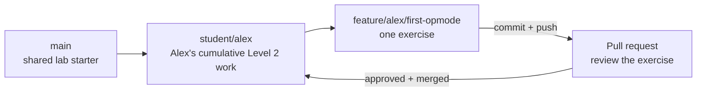

# Prepare Android Studio and Your Level 2 Branch

FIRST maintains the Android Studio and FTC SDK installation documentation. This
course links to those instructions instead of copying steps that can become
outdated.

## Team versions

```text
FTC SDK version: 11.2.1
Hardware-lab repository: https://github.com/sroorda/ftc-hardware-lab
Minimum Android Studio: Narwhal 3 Feature Drop
```

Use the versions supplied by the team repository even if Android Studio offers a
newer Android Gradle Plugin, Gradle version, SDK component, or Java configuration.

## Install Android Studio

Follow FIRST's
[Android Studio Programming Tutorial](https://ftc-docs.firstinspires.org/en/latest/programming_resources/android_studio_java/Android-Studio-Tutorial.html)
through the Android Studio installation and required Android SDK preparation.

You also need Git installed as described in
[Set Up GitHub and Git](github-and-git-setup.md). Android Studio uses that Git
installation for cloning, branches, commits, and pushes.

## Clone the hardware-lab repository in Android Studio

Android's
[Version control basics](https://developer.android.com/studio/projects/version-control)
describes Android Studio's Git integration.

From the Android Studio welcome screen:

1. Select **Get from VCS**.
2. Select **Git** as the version-control system.
3. Paste `https://github.com/sroorda/ftc-hardware-lab` into the URL field.
4. Choose the parent folder where Android Studio should create the local project.
5. Select **Clone**.
6. Complete the GitHub sign-in prompt if Android Studio displays one.
7. Trust the project when Android Studio asks.
8. Allow Gradle sync to finish before editing or running anything.
9. Build the project once without making changes.

If another project is already open, use **File → New → Project from Version
Control** instead.

Do not open only the `TeamCode` directory. Android Studio must clone and open the
complete FTC project.

## Create your personal branch in Android Studio

### Why you need a personal branch

A personal branch lets you complete every lab independently without changing
another student's code. It becomes your cumulative Level 2 implementation.

Choose your own short, recognizable name. You can use your first name, GitHub
username, or another team nickname:

```text
student/alex
student/robotdog17
```

No one assigns the name, but each student must choose a different one.

Android Studio shows the current Git branch in the branch widget near the top of
the window.

1. Confirm the current branch is `main`.
2. Open the branch widget.
3. Select `main`, then choose **New Branch from 'main'**.
4. Enter the personal name you chose, such as `student/alex`.
5. Keep **Checkout branch** selected and create the branch.
6. Use **Git → Push** to publish the branch to the team repository.
7. Confirm the new branch appears on GitHub.

JetBrains' official
[Manage Git branches](https://www.jetbrains.com/help/idea/manage-branches.html)
reference contains screenshots and more detail. The same Git interface is used by
Android Studio.

Do not create exercise feature branches yet. The first hardware exercise will
introduce that workflow after you have code worth committing and reviewing.

## Preview the Level 2 branch workflow

Each exercise will use a temporary feature branch created from your personal
branch. A feature branch isolates one focused change so it can be inspected,
tested, discussed, and merged without mixing it with unrelated work.



Lesson 1 will walk you through creating the feature branch, writing and testing
the first OpMode, inspecting the diff, committing, pushing, opening a pull request,
obtaining a peer or mentor review, and merging into your personal branch.

The pull request targets `student/<your-name>`. It does not target `main`, another
student's branch, or FIRST's official repository.

During the competition season, the destination is normally a shared competition
branch instead of a personal branch. The habit remains the same:

```text
shared branch → feature branch → pull request → review → shared branch
```

GitHub's
[Getting started with Git](https://docs.github.com/en/get-started/learning-to-code/getting-started-with-git)
provides a broader introduction. You do not need to memorize the complete workflow
during setup; Lesson 1 introduces each action when it has a purpose.

## Understand the project boundary

Student Level 2 code belongs under the `TeamCode` module in the
`org.firstinspires.ftc.teamcode.level2` package. Do not modify the
`FtcRobotController` module or its included sample files. FIRST's
[Creating and Running an OpMode](https://ftc-docs.firstinspires.org/en/latest/programming_resources/tutorial_specific/android_studio/creating_op_modes/Creating-and-Running-an-Op-Mode-%28Android-Studio%29.html)
page explains this module boundary and where the official samples live.

The hardware repository's
[Hardware Lab Contract](https://github.com/sroorda/ftc-hardware-lab/blob/main/docs/HARDWARE_LAB.md)
records the package boundary, device configuration names, and branch conventions
used by the lessons.

## Pause and get help when

- Gradle sync proposes changing project versions;
- Android Studio asks to upgrade the Android Gradle Plugin;
- the expected FTC SDK version does not match the project;
- a build error mentions signing, SDK components, Gradle, or Java compatibility;
- you are tempted to edit `FtcRobotController`; or
- Android Studio requests administrator access or an unfamiliar credential.

Return to [Level 2 Setup](level-2-setup.md) after the project builds successfully.
The first hardware lesson will have you write code before connecting Android
Studio to the Control Hub.
