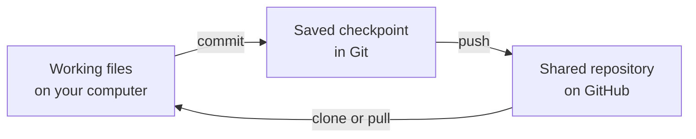

# Set Up GitHub and Git for Level 2

## Why we use Git

Programming is experimental. Git records useful checkpoints so you can see what
changed, return to working code, and compare your solution with another student's
without sharing the same working files.

Git runs on your computer. GitHub stores the shared copy online and provides pull
requests for reviewing proposed changes.



GitHub's [About Git](https://docs.github.com/en/get-started/using-git/about-git)
explains version control, repositories, commits, branches, and how Git works with
GitHub. Its [Getting started with Git](https://docs.github.com/en/get-started/learning-to-code/getting-started-with-git)
guide provides a longer hands-on introduction with pictures.

## Terms you will see

| Term | Meaning in this course |
|---|---|
| Repository | The project files together with their saved Git history |
| Local | The copy on your computer |
| Remote | A copy stored elsewhere; our remote is hosted on GitHub |
| `origin` | Git's short name for the team repository you cloned |
| Commit | A named checkpoint containing a specific set of changes |
| Branch | An independent line of work within a repository |
| Clone | Download a repository and its history to your computer |
| Push | Send your local commits to GitHub |
| Pull | Bring newer commits from GitHub into your local branch |
| Pull request | A GitHub page for comparing, discussing, and merging branches |

You do not need to memorize commands before Level 2. Android Studio provides the
Git actions we will use, and the hardware exercises will introduce each action
when it has a purpose.

## 1. Create your GitHub account

Follow GitHub's official
[Creating an account on GitHub](https://docs.github.com/en/get-started/start-your-journey/creating-an-account-on-github)
instructions. Choose your own username and verify your email address.

After the account is ready:

1. Give your GitHub username to the team repository owner.
2. Accept the invitation to the team's repository or GitHub organization.
3. Open the
   [FTC hardware-lab repository](https://github.com/sroorda/ftc-hardware-lab)
   and confirm that you can see it.

Do not put a password, access token, recovery code, or Control Hub Wi-Fi credential
in a repository or AI prompt.

## 2. Install Git

Follow GitHub's official
[Set up Git](https://docs.github.com/en/get-started/git-basics/set-up-git)
instructions for your operating system. Then open a terminal and run:

```text
git --version
```

Continue when Git prints a version instead of an error.

## 3. Identify your commits

Use the name you want teammates to see in repository history and the email address
associated with your GitHub account:

```text
git config --global user.name "Your Name"
git config --global user.email "your-email@example.com"
```

Verify the saved values:

```text
git config --global user.name
git config --global user.email
```

GitHub provides a `noreply` email address if you prefer not to show a personal
email in commits.

## Check your setup

You are ready to continue when:

- `git --version` succeeds;
- your Git name and email are configured;
- you accepted the repository invitation; and
- you can view the hardware-lab repository on GitHub.

Continue to
[Prepare Android Studio and Your Level 2 Branch](android-studio-ftc-setup.md).
Android Studio will clone the repository and manage the branches you use in the
labs.
