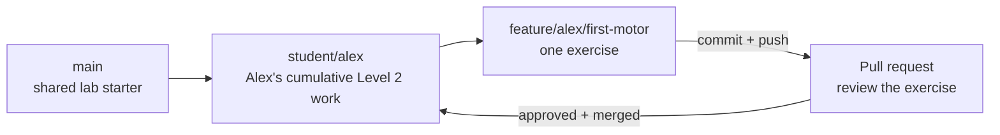

# How Level 2 Branches Work

Level 2 uses two kinds of student branches. You create the personal branch during
setup. The first hardware exercise creates a feature branch and walks through the
complete review process.

## Why each student gets a personal branch

A personal branch lets you complete every lab independently without changing
another student's code. It becomes your cumulative Level 2 implementation.

Choose your own short, recognizable name:

```text
student/alex
student/robotdog17
```

No one assigns the name, but each student must choose a different one.

## Why exercises use feature branches

A feature branch isolates one focused change. That makes the change easy to
inspect, discuss, test, and merge without mixing it with unrelated work.



The first exercise will guide you through this sequence:

1. Start on your `student/<name>` branch.
2. Create and switch to a `feature/<name>/<exercise>` branch in Android Studio.
3. Complete and test the exercise.
4. Review the changed files in Android Studio.
5. Commit the working change.
6. Push the feature branch to GitHub.
7. Open a pull request whose target is your `student/<name>` branch.
8. Ask a mentor or another student to review and approve it.
9. Merge the pull request into your personal branch.
10. Update Android Studio to the newly merged personal branch.

The reviewer comments through the pull request rather than editing your branch.
The pull request does not target `main`, another student's branch, or FIRST's
official repository.

## How this relates to competition code

The course uses your personal branch as the integration branch so every student
can keep a separate body of work. During the season, the same pattern usually
looks like this:

```text
shared competition branch → feature branch → pull request → review → shared branch
```

The destination changes, but the professional habit is the same: isolate one
change, test it, explain it, review it, and merge it intentionally.

GitHub's [Getting started with Git](https://docs.github.com/en/get-started/learning-to-code/getting-started-with-git)
provides a broader illustrated introduction to branches, commits, pushes, and pull
requests. The first hardware exercise will provide the exact Android Studio clicks
when the workflow is introduced.
