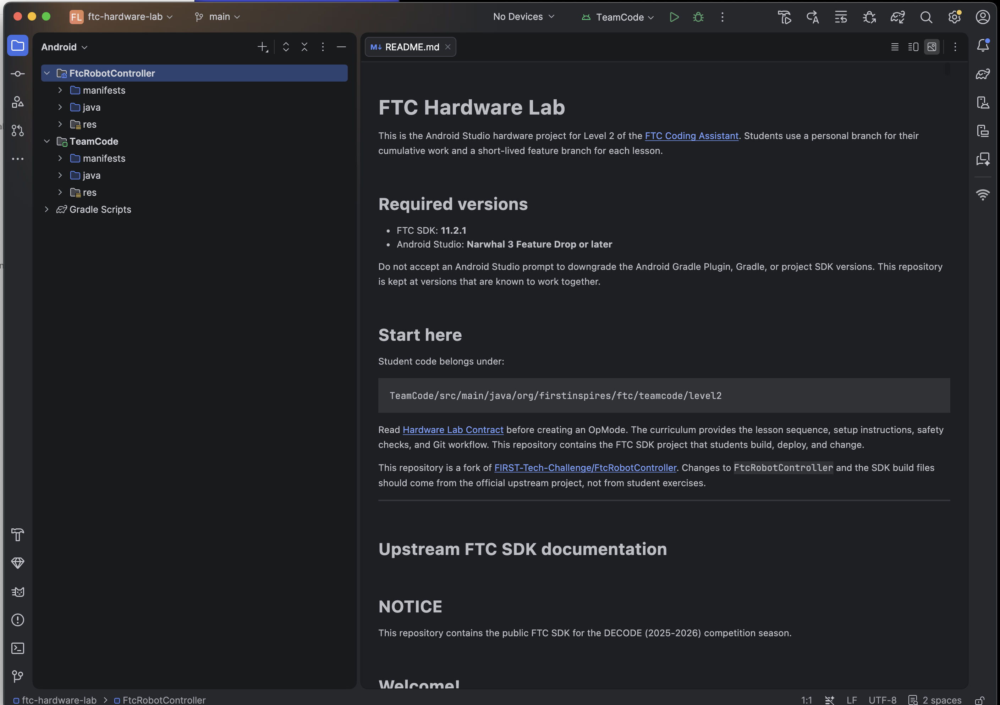
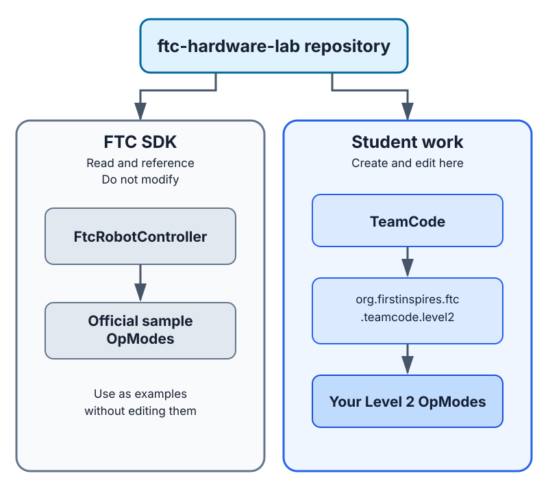
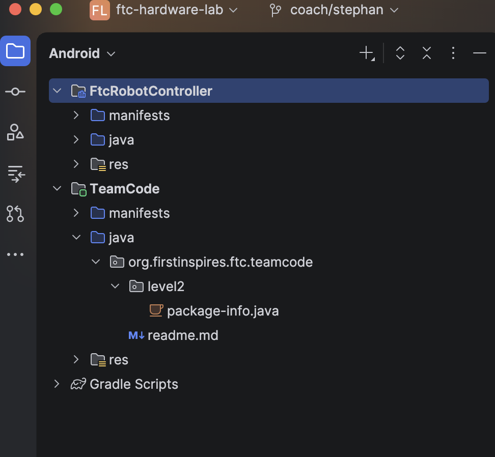

# Level 2 Setup

Level 2 moves from small desktop Java programs to an Android Studio project that
can deploy code to FTC hardware. Complete this setup before Lesson 1. You will
write your first OpMode before connecting Android Studio to the Control Hub.

## What you need

- Access to the
  [FTC hardware-lab repository](https://github.com/sroorda/ftc-hardware-lab)
- A GitHub account with permission to push branches to that repository
- Git and a supported version of Android Studio
- The configured hardware test bench when you begin Lesson 1

Do not clone the official FIRST repository for this course. The team hardware-lab
repository is the FTC project where your Level 2 work belongs.

> **Note:** The hardware-lab repository is currently based on FTC SDK `11.2.1`.
> The SDK is already part of the project; you do not need to download it
> separately.

## 1. Set up GitHub and Git

Follow [Set Up GitHub and Git](github-and-git-setup.md) if your account, repository
access, Git installation, name, or email is not ready. Return here when those setup
checks succeed.

## 2. Install Android Studio

The hardware-lab repository requires **Android Studio Narwhal 3 Feature Drop or
later**. Follow FIRST's maintained
[Android Studio Programming Tutorial](https://ftc-docs.firstinspires.org/en/latest/programming_resources/android_studio_java/Android-Studio-Tutorial.html)
through Android Studio installation and Android SDK preparation.

Use the versions already defined by the hardware-lab repository. Do not accept a
prompt to upgrade or downgrade the Android Gradle Plugin, Gradle, FTC SDK, or Java
configuration.

## 3. Clone the hardware-lab repository

Android's
[Version control basics](https://developer.android.com/studio/projects/version-control)
describes Android Studio's Git integration.

From the Android Studio welcome screen:

1. Select **Get from VCS**.
2. Select **Git** as the version-control system.
3. Paste `https://github.com/sroorda/ftc-hardware-lab` into the URL field.
4. Choose the parent folder where Android Studio should create the local project.
5. Select **Clone**.
6. Complete the GitHub sign-in prompt if Android Studio displays one.
7. Trust the project when Android Studio asks.
8. Allow Gradle sync to finish before editing or running anything.

If another project is already open, use **File → New → Project from Version
Control** instead.

Open the complete FTC project, not only the `TeamCode` directory.

## 4. Build the unchanged project

Build the project once before changing any files. This separates computer and
project setup problems from mistakes in new student code.

Continue when Gradle sync and the `TeamCode` build complete without project
upgrades or source changes.

### What Android Studio should look like

After the build, Android Studio should look similar to this:



Check these parts of the window:

- the project is named `ftc-hardware-lab`;
- the Android project view contains both `FtcRobotController` and `TeamCode`;
- `TeamCode` is selected as the run configuration;
- the current branch is still `main` before you complete the next section; and
- **No Devices** is expected because you do not connect to the Control Hub until
  Lesson 1.

Your operating system, theme, and Android Studio layout may look different. The
screenshot confirms the expected project structure; it does not replace a
successful Gradle sync and `TeamCode` build.

## 5. Create your personal branch

A personal branch lets you complete every lab independently without changing
another student's code. It becomes your cumulative Level 2 implementation.

Choose your own short, recognizable name. You can use your first name, GitHub
username, or another team nickname:

```text
student/alex
student/robotdog17
```

No one assigns the name, but each student must choose a different one.

In Android Studio:

1. Confirm the current branch is `main`.
2. Open the branch widget near the top of the window.
3. Select `main`, then choose **New Branch from 'main'**.
4. Enter your personal branch name, such as `student/alex`.
5. Keep **Checkout branch** selected and create the branch.
6. Use **Git → Push** to publish the branch to the team repository.
7. Confirm the branch appears on GitHub.

JetBrains' official
[Manage Git branches](https://www.jetbrains.com/help/idea/manage-branches.html)
reference contains screenshots and more detail. Android Studio uses the same Git
interface.

Do not create a feature branch yet. Lesson 1 introduces that workflow when you
have an OpMode worth committing, reviewing, and merging.

## Understand the project boundary

| Project boundary | What it looks like in Android Studio |
|---|---|
|  |  |

Student Level 2 code belongs under the `TeamCode` module in the
`org.firstinspires.ftc.teamcode.level2` package. Do not modify the
`FtcRobotController` module or its included sample files. FIRST's
[Creating and Running an OpMode](https://ftc-docs.firstinspires.org/en/latest/programming_resources/tutorial_specific/android_studio/creating_op_modes/Creating-and-Running-an-Op-Mode-%28Android-Studio%29.html)
page explains this module boundary and where the official samples live.

The hardware repository's
[Hardware Lab Contract](https://github.com/sroorda/ftc-hardware-lab/blob/main/docs/HARDWARE_LAB.md)
records the package boundary, device configuration names, and branch conventions
used by the lessons.

## Pause and get help when

- Gradle sync proposes changing project versions;
- Android Studio asks to change the Android Gradle Plugin;
- the expected FTC SDK version does not match the project;
- a build error mentions signing, SDK components, Gradle, or Java compatibility;
- you are tempted to edit `FtcRobotController`; or
- Android Studio requests administrator access or an unfamiliar credential.

## You are ready when

- Android Studio shows the hardware-lab repository as `origin`;
- Android Studio shows `student/<your-name>` as the current branch;
- the personal branch appears in the hardware-lab repository on GitHub;
- Git reports no uncommitted changes;
- Gradle sync completes without requiring project upgrades; and
- the `TeamCode` module builds successfully.

When these checks succeed, continue to
[Lesson 1: Your First Hardware OpMode](../level-2/01-first-hardware-opmode/README.md).
It will create the first feature branch, introduce the OpMode lifecycle, have you
write and build your first OpMode, and then direct you to the Control Hub
connection guide.
