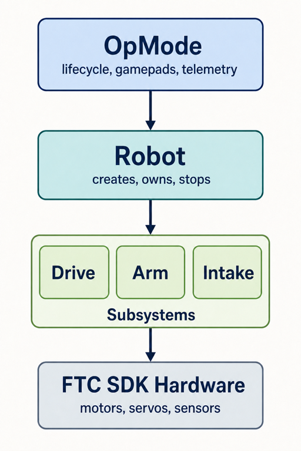

# Thin, Domain-Oriented Robot Architecture

Use this architecture to keep the robot code easy to read, test, and reuse. The
framework should describe what the robot can do without hiding how the FTC
lifecycle works.



A useful subsystem operation uses team vocabulary:

```java
intake.intake();
arm.moveTo(ArmSubsystem.Goal.HIGH_SCORE);
drive.driveFieldRelative(forward, right, rotate);
```

Avoid generic methods that merely rename an FTC SDK call:

```java
robot.setMotorPower("arm", 0.4);
robot.setServoPosition("claw", 0.7);
```

## Responsibilities and proposed package layout

| Layer | Package | Owns | Must not own |
|---|---|---|---|
| OpMode | `opmodes` | FTC lifecycle, gamepads, autonomous choices, telemetry | motor directions, limits, repeated mechanism calculations |
| `Robot` | `robot` | subsystem construction, access, complete shutdown | gamepad bindings, mechanism algorithms |
| Subsystem | `subsystems` | related devices, safe operations, state, sensor interpretation | gamepads, `waitForStart()`, Driver Station lifecycle |
| Logic class | `logic` | calculations and decisions that can run without hardware | `HardwareMap`, motors, servos, FTC lifecycle |

The matching project layout is:

```text
TeamCode/src/main/java/org/firstinspires/ftc/teamcode/
├── opmodes/       TeleOp and autonomous entry points
├── robot/         Robot and verified hardware names
├── subsystems/    drive, arm, intake, and other mechanisms
└── logic/         hardware-independent calculations and decisions
```

Create a package when the team has code that belongs there. Do not create empty
packages for possible future mechanisms.

## Design rules

### 1. Give every output one owner

Exactly one subsystem owns each motor and servo. Only that subsystem sends
commands to the device. This prevents two parts of the program from fighting over
the same output.

### 2. Keep hardware private

Hardware fields are `private`. OpModes use public subsystem operations and query
methods; they do not retrieve owned devices with `hardwareMap.get(...)` or ask a
subsystem for its motor object.

Keep Driver Station configuration names in one obvious class. Verify every name
against the active configuration and the physical wiring contract.

### 3. Put safety at the lowest useful layer

Power limits, travel limits, incompatible states, sensor polarity, and safe
defaults belong in the subsystem that owns the hardware. An OpMode may choose a
lower power, but it cannot bypass subsystem safety.

Initialization leaves the mechanism safe. `stop()` immediately commands a safe
output and may be called more than once.

### 4. Reuse domain operations

The same operation should work from TeleOp and autonomous code. A subsystem must
not care whether a gamepad button or an autonomous decision called it.

## Example Architecture

Below is a top down example in the same direction that robot behavior runs: OpMode, `Robot`,
subsystem, hardware configuration.

### 1. The OpMode

The OpMode owns the FTC lifecycle and decides what the controls mean. Its main
loop should read like a short list of robot intentions.

```java
package org.firstinspires.ftc.teamcode.opmodes;

import com.qualcomm.robotcore.eventloop.opmode.OpMode;
import com.qualcomm.robotcore.eventloop.opmode.TeleOp;

import org.firstinspires.ftc.teamcode.robot.Robot;

@TeleOp(name = "Intake Test", group = "Test")
public final class IntakeTest extends OpMode {
    private Robot robot;

    @Override
    public void init() {
        robot = new Robot(hardwareMap);
        telemetry.addData("Status", "Initialized and stopped");
        telemetry.update();
    }

    @Override
    public void loop() {
        if (gamepad2.right_bumper && !gamepad2.left_bumper) {
            robot.getIntake().intake();
        } else if (gamepad2.left_bumper && !gamepad2.right_bumper) {
            robot.getIntake().eject();
        } else {
            robot.getIntake().stop();
        }

        telemetry.addData("Intake state", robot.getIntake().getState());
        telemetry.addData("Intake power", "%.2f",
                robot.getIntake().getAppliedPower());
        telemetry.update();
    }

    @Override
    public void stop() {
        if (robot != null) {
            robot.stop();
        }
    }
}
```

The OpMode knows which buttons mean intake and eject. It does not know the motor
name, direction, or safe power limit.

### 2. The `Robot` class assembles the subsystems

`Robot` creates the complete robot and provides one place to stop every powered
subsystem.

```java
package org.firstinspires.ftc.teamcode.robot;

import com.qualcomm.robotcore.hardware.HardwareMap;

import org.firstinspires.ftc.teamcode.subsystems.IntakeSubsystem;

public final class Robot {
    private final IntakeSubsystem intake;

    public Robot(HardwareMap hardwareMap) {
        intake = new IntakeSubsystem(hardwareMap);
    }

    public IntakeSubsystem getIntake() {
        return intake;
    }

    public void stop() {
        intake.stop();
    }
}
```

Add another subsystem only after it works independently. Keep construction and
shutdown explicit so another programmer can trace them easily.

###3. Behavior and Limits belong in the Subsystem

The intake owns its motor. Its public methods describe mechanism behavior rather
than exposing lower level functions like motor power to the OpMode.

```java
package org.firstinspires.ftc.teamcode.subsystems;

import com.qualcomm.robotcore.hardware.DcMotor;
import com.qualcomm.robotcore.hardware.DcMotorEx;
import com.qualcomm.robotcore.hardware.HardwareMap;
import com.qualcomm.robotcore.util.Range;

import org.firstinspires.ftc.teamcode.robot.RobotHardwareNames;

public final class IntakeSubsystem {
    public enum State {
        STOPPED,
        INTAKING,
        EJECTING
    }

    private static final double INTAKE_POWER = 0.25;
    private static final double EJECT_POWER = -0.20;
    private static final double MAX_POWER = 0.25;

    private final DcMotorEx motor;
    private State state = State.STOPPED;
    private double appliedPower;

    public IntakeSubsystem(HardwareMap hardwareMap) {
        motor = hardwareMap.get(
                DcMotorEx.class,
                RobotHardwareNames.INTAKE_MOTOR);

        motor.setDirection(DcMotor.Direction.FORWARD);
        motor.setZeroPowerBehavior(DcMotor.ZeroPowerBehavior.BRAKE);
        motor.setMode(DcMotor.RunMode.RUN_WITHOUT_ENCODER);
        stop();
    }

    public void intake() {
        apply(State.INTAKING, INTAKE_POWER);
    }

    public void eject() {
        apply(State.EJECTING, EJECT_POWER);
    }

    public void stop() {
        apply(State.STOPPED, 0.0);
    }

    public State getState() {
        return state;
    }

    public double getAppliedPower() {
        return appliedPower;
    }

    private void apply(State newState, double desiredPower) {
        appliedPower = Range.clip(desiredPower, -MAX_POWER, MAX_POWER);
        state = appliedPower == 0.0 ? State.STOPPED : newState;
        motor.setPower(appliedPower);
    }
}
```

If the real intake later gains a sensor or interlock, enforce it inside `apply()`.
The OpMode continues calling the same `intake()`, `eject()`, and `stop()` methods.

### 4. Keep the Hardware Configuration in one place

Configuration names are easy to locate and compare with the Driver Station.

```java
package org.firstinspires.ftc.teamcode.robot;

public final class RobotHardwareNames {
        public static final String INTAKE_MOTOR = "VERIFY_intake_motor";

    private RobotHardwareNames() {
        // Constants only; do not instantiate this class.
    }
}
```

Keep directions, gear ratios, and limits near the subsystem behavior that uses
them. Move those values into a separate robot configuration only when the team
actually supports more than one physical robot.
