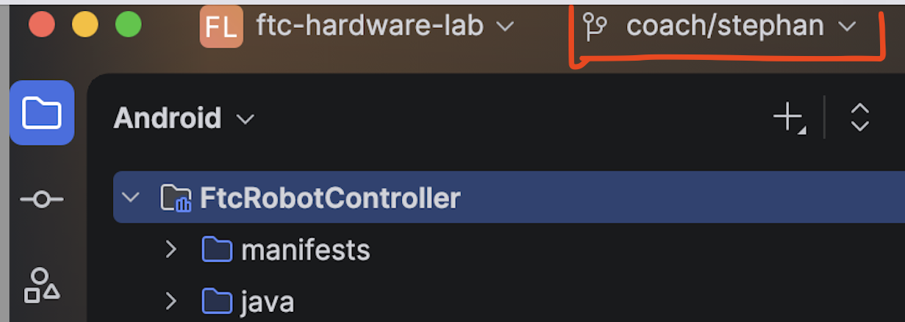
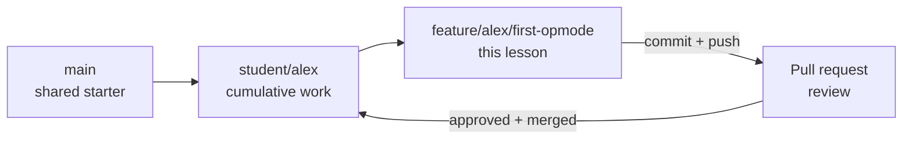
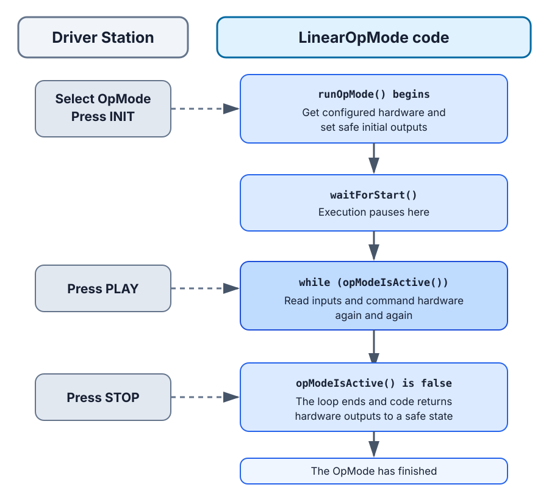

# Lesson 1: Your First Hardware OpMode

Your Java code is about to control physical hardware. You will create an FTC
OpMode, build it before connecting to the robot, deploy it to the Control Hub, and
use limited gamepad input to run the test-bench motor.

This lesson also introduces the complete feature-branch workflow. Future lessons
will repeat the workflow with less step-by-step guidance.

## Your mission

| | |
|---|---|
| **Time** | 90–120 minutes, including the first deployment |
| **FTC focus** | `LinearOpMode`, lifecycle, `hardwareMap`, safe motor control |
| **Git focus** | feature branch, commit, push, pull request, review, merge |
| **AI tutor** | explain lifecycle and review safety without writing the OpMode |

## Your goal

By the end of this lesson, you can:

- explain initialization, Start, the active loop, and Stop;
- connect a Driver Station configuration name to a Java hardware object;
- build an FTC project before connecting to a Control Hub;
- safely command and stop one motor; and
- merge reviewed work from a feature branch into your personal branch.

## Get ready

Complete [Level 2 Setup](../../docs/level-2-setup.md). Android Studio should show
`student/<your-name>` as the current branch, and the unchanged `TeamCode` module
should build successfully.



Before Java can control a device, the active Driver Station configuration must
connect a configuration name to the device type and physical Control Hub port.
Lesson 1 needs the first hardware entry from the lab configuration:

| Test-bench device | Control Hub port | Driver Station configuration type | FTC SDK type | Configuration name |
|---|---|---|---|---|
| goBILDA Yellow Jacket motor | Motor 0 | `GoBILDA 5202/3/4 series` | `DcMotor` | `bench_motor` |

Your Java code retrieves that configured device through `hardwareMap`:

```java
DcMotor benchMotor = hardwareMap.get(DcMotor.class, "bench_motor");
```

- `DcMotor.class` is the device type Java expects.
- `"bench_motor"` must match the name in the active Driver Station configuration
  exactly, including capitalization.
- `benchMotor` is only the Java variable name, so it does not need to match.

You only need to configure `bench_motor` for this lesson. If you prefer, you can
set up every test-bench device now by following the
[Hardware Lab Contract](../../docs/hardware-lab-contract.md)
in Student Reference.

## Part 1 — Create the feature branch

Your personal branch stores your cumulative Level 2 work. A feature branch
isolates one focused change so another person can inspect and review it.



In Android Studio:

1. Confirm the current branch is `student/<your-name>`.
2. Open the branch widget and select **New Branch**.
3. Enter `feature/<your-name>/first-opmode`.
4. Keep **Checkout branch** selected.
5. Confirm the branch widget shows the feature branch.

Do not create the branch from `main`. Run `git status` in Android Studio's terminal
if you are uncertain which branch is active.

## Part 2 — Watch and understand the lifecycle

Watch
[Learn Java for Robotics: Your First Program (FTC)](https://youtu.be/F24X8Ut83os)
by Brogan M. Pratt.

As you watch, look for the four jobs that a basic hardware OpMode must do:

1. Get hardware from the robot configuration.
2. Wait for the driver to press **START**.
3. Repeat while the OpMode is active.
4. Read an input and use it to command hardware.

You do not need to write a video summary. The starter OpMode in Part 3 labels
these four areas. You will demonstrate what you understood by completing them
and running the result on the hardware bench.

An OpMode is a Java class the Robot Controller can discover and run. A
`LinearOpMode` uses `runOpMode()` to describe its sequence.



## Part 3 — Create the OpMode

Under this folder in the hardware-lab repository:

```text
TeamCode/src/main/java/org/firstinspires/ftc/teamcode/level2
```

create `FirstHardwareOpMode.java` with this starter structure:

```java
package org.firstinspires.ftc.teamcode.level2;

import com.qualcomm.robotcore.eventloop.opmode.LinearOpMode;
import com.qualcomm.robotcore.eventloop.opmode.TeleOp;
import com.qualcomm.robotcore.hardware.DcMotor;

@TeleOp(name = "L2 First Hardware", group = "Level 2")
public class FirstHardwareOpMode extends LinearOpMode {
    private DcMotor benchMotor;

    @Override
    public void runOpMode() {
        // Area 1: Get hardware from the robot configuration.
        // TODO: retrieve bench_motor from hardwareMap
        // TODO: set a deliberate zero-power behavior and zero power

        // Area 2: Wait for the driver to press START.
        waitForStart();

        if (isStopRequested()) {
            return;
        }

        // Area 3: Repeat while the OpMode is active.
        while (opModeIsActive()) {
            // Area 4: Read an input and use it to command hardware.
            // TODO: calculate limited power from the left stick
            // TODO: send that power to the motor
        }

        // TODO: return the motor to zero power
    }
}
```

`@TeleOp` places the class in the Driver Station's TeleOp list. `@Override` tells
Java that `runOpMode()` implements behavior required by `LinearOpMode`.

The FTC SDK also provides the iterative `OpMode` type. An iterative OpMode uses
separate lifecycle methods such as `init()`, `start()`, `loop()`, and `stop()`.
This course begins with `LinearOpMode` because its top-to-bottom flow is easier
to follow. You will encounter iterative OpModes when reading other FTC code.

Complete the TODOs using these requirements:

1. Retrieve a `DcMotor` with `hardwareMap.get(...)` and the exact name
   `bench_motor`.
2. Set motor power to `0.0` during initialization.
3. Choose `BRAKE` or `FLOAT` zero-power behavior and record why.
4. Use `-gamepad1.left_stick_y` so pushing the stick forward requests positive
   power.
5. Multiply the request by `0.25`, limiting the first test to 25% power.
6. Set power to zero after the active loop.

The FTC SDK contains official examples under
`FtcRobotController/.../external/samples`. Use `BasicOpMode_Linear` as a reference,
but do not modify or copy your lesson file into the samples directory.

## Part 4 — Build before connecting

Use **Build → Make Project**. Correct every compile error before connecting to the
Control Hub.

Answer these questions before continuing:

- Which code runs when INIT is pressed?
- Where does execution pause before PLAY?
- Which condition makes the loop end?
- Which line guarantees zero requested power after the loop?
- Why can the project compile even if `bench_motor` is misspelled?

## Part 5 — Connect and test

Now follow
[Connect Android Studio to the Control Hub](../../docs/control-hub-connection.md).
Return here when Android Studio shows the Control Hub as a deployment target.

Before pressing Run:

1. Confirm the feature branch is active.
2. On the Driver Station, confirm the active configuration contains a motor named
   exactly `bench_motor`.
3. Predict the moving device, direction, maximum power, and stopping action.
4. Clear the test bench.
5. Keep the Driver Station Stop control available.

Deploy the app, select **L2 First Hardware**, press INIT, then PLAY. Move the left
stick slowly in both directions and press Stop. Record:

- whether the configured motor was found;
- observed direction for positive and negative input;
- whether the motor stopped when the stick returned to center; and
- whether Stop ended motion immediately.

Do not change direction merely because the mechanism uses a different physical
definition of “forward.” Record what happened; Lesson 3 handles direction
deliberately.

## Part 6 — Commit, review, and merge

Open Android Studio's Commit view and inspect the diff. Be able to explain every
changed line.

1. Commit with a focused message such as `Add first hardware OpMode`.
2. Push `feature/<your-name>/first-opmode` to GitHub.
3. Create a pull request on `sroorda/ftc-hardware-lab`.
4. Set the base branch to `student/<your-name>` and the compare branch to your
   feature branch. GitHub may otherwise suggest FIRST's upstream repository.
5. Describe the build and hardware test results.
6. Ask another student or a mentor to review and approve the pull request.
7. Respond to comments and push corrections to the same feature branch.
8. Merge the approved pull request.
9. In Android Studio, switch to `student/<your-name>` and pull the merged commit.
10. Run `git status` and confirm the working tree is clean.

The reviewer comments through the pull request. They do not need to edit your
branch or run your hardware test for you.

## Ask your AI tutor

> Review my `FirstHardwareOpMode` without editing it. Trace what happens during
> INIT, after PLAY, on every active loop, and after STOP. Identify any path that
> can leave the motor powered, then ask me to explain how `bench_motor` connects
> the Driver Station configuration to Java.

## Check your work

You are finished when:

- the project builds before the Control Hub is connected;
- the OpMode appears under its intended Driver Station name;
- `hardwareMap` finds the configured motor;
- the stick commands no more than 25% power;
- centered input and Stop both result in zero power;
- the pull request records observed evidence; and
- the reviewed change is merged into `student/<your-name>`.

## Reflect

Why is the hardware configuration name a runtime contract rather than something
the Java compiler can verify?

Continue to [Lesson 2: Telemetry and Logging](../02-telemetry-and-logging/README.md).
