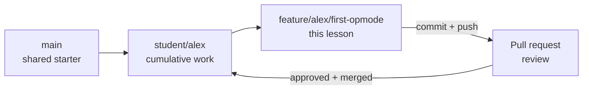

# Lesson 1: Your First Hardware OpMode

Your Java code is about to control physical hardware. You will create an FTC
OpMode, build it before connecting to the robot, deploy it to the Control Hub, and
use limited gamepad input to run the test-bench motor.

This lesson also introduces the complete feature-branch workflow. Future lessons
will repeat the workflow with less step-by-step guidance.

## Your mission

| | |
|---|---|
| **Time** | 90–120 minutes, including the first deployment |
| **FTC focus** | `LinearOpMode`, lifecycle, `hardwareMap`, safe motor control |
| **Git focus** | feature branch, commit, push, pull request, review, merge |
| **AI tutor** | explain lifecycle and review safety without writing the OpMode |

## Your goal

By the end of this lesson, you can:

- explain initialization, Start, the active loop, and Stop;
- connect a Driver Station configuration name to a Java hardware object;
- build an FTC project before connecting to a Control Hub;
- safely command and stop one motor; and
- merge reviewed work from a feature branch into your personal branch.

## Get ready

Complete [Level 2 Setup](../../docs/level-2-setup.md). Android Studio should show
`student/<your-name>` as the current branch, and the unchanged `TeamCode` module
should build successfully.


Before Java can control a device, the active Driver Station configuration must
connect a configuration name to the device type and physical Control Hub port.
Lesson 1 needs the first hardware entry from the lab configuration:

| Test-bench device | Control Hub port | Driver Station configuration type | FTC SDK type | Configuration name |
|---|---|---|---|---|
| [goBILDA 5203 Yellow Jacket, 19.2:1, 312 RPM](https://www.gobilda.com/5203-series-yellow-jacket-planetary-gear-motor-19-2-1-ratio-24mm-length-8mm-rex-shaft-312-rpm-3-3-5v-encoder/) | Motor 0 | `GoBILDA 5202/3/4 series` | `DcMotor` | `bench_motor` |

Your Java code retrieves that configured device through `hardwareMap`:

```java
DcMotor benchMotor = hardwareMap.get(DcMotor.class, "bench_motor");
```

- `DcMotor.class` is the device type Java expects.
- `"bench_motor"` must match the name in the active Driver Station configuration
  exactly, including capitalization.
- `benchMotor` is only the Java variable name, so it does not need to match.

You only need to configure `bench_motor` for this lesson. If you prefer, you can
set up every test-bench device now by following the
[Hardware Lab Contract](../../docs/hardware-lab-contract.md)
in Student Reference.

## Part 1 — Create the feature branch

Your personal branch stores your cumulative Level 2 work. A feature branch
isolates one focused change so another person can inspect and review it.



In Android Studio:

1. Confirm the current branch is `student/<your-name>`.
2. Open the branch widget and select **New Branch**.
3. Enter `feature/<your-name>/first-opmode`.
4. Keep **Checkout branch** selected.
5. Confirm the branch widget shows the feature branch.

Do not create the branch from `main`. Run `git status` in Android Studio's terminal
if you are uncertain which branch is active.

## Part 2 — Watch and understand the lifecycle

Watch
[Learn Java for Robotics: Your First Program (FTC)](https://youtu.be/F24X8Ut83os)
by Brogan M. Pratt.

As you watch, look for the four jobs that a basic hardware OpMode must do:

1. Get hardware from the robot configuration.
2. Wait for the driver to press **START**.
3. Repeat while the OpMode is active.
4. Read an input and use it to command hardware.

You do not need to write a video summary. The starter OpMode in Part 3 labels
these four areas. You will demonstrate what you understood by completing them
and running the result on the hardware bench.

An OpMode is a Java class the Robot Controller can discover and run. A
`LinearOpMode` uses `runOpMode()` to describe its sequence.


## Part 3 — Create the OpMode

Under this folder in the hardware-lab repository:

```text
TeamCode/src/main/java/org/firstinspires/ftc/teamcode/level2
```

create `FirstHardwareOpMode.java` with this starter structure:

```java
package org.firstinspires.ftc.teamcode.level2;

import com.qualcomm.robotcore.eventloop.opmode.LinearOpMode;
import com.qualcomm.robotcore.eventloop.opmode.TeleOp;
import com.qualcomm.robotcore.hardware.DcMotor;

@TeleOp(name = "L2 First Hardware", group = "Level 2")
public class FirstHardwareOpMode extends LinearOpMode {
    private DcMotor benchMotor;

    @Override
    public void runOpMode() {
        // Area 1: Get hardware from the robot configuration.
        // TODO: retrieve bench_motor from hardwareMap
        // TODO: set a deliberate zero-power behavior and zero power

        // Area 2: Wait for the driver to press START.
        waitForStart();

        // Area 3: Repeat while the OpMode is active.
        while (opModeIsActive()) {
            // Area 4: Read an input and use it to command hardware.
            // TODO: calculate limited power from the left stick
            // TODO: send that power to the motor
        }

        // TODO: return the motor to zero power
    }
}
```

`@TeleOp` places the class in the Driver Station's TeleOp list. `@Override` tells
Java that `runOpMode()` implements behavior required by `LinearOpMode`.

The FTC SDK also provides the iterative `OpMode` type. An iterative OpMode uses
separate lifecycle methods such as `init()`, `start()`, `loop()`, and `stop()`.
This course begins with `LinearOpMode` because its top-to-bottom flow is easier
to follow. You will encounter iterative OpModes when reading other FTC code.

### Complete one area at a time

The following examples introduce the FTC APIs used by the TODOs. Add each small
piece to the matching labeled area in your starter OpMode. After each step, pause
and explain what the code will cause the robot to do. Work through the six steps
in order because each one builds on the hardware setup before it.

#### 1. Get the configured motor

Use `hardwareMap` to retrieve the motor configured as `bench_motor` and store it
in the `benchMotor` field declared near the top of the class:

```java
benchMotor = hardwareMap.get(DcMotor.class, "bench_motor");
```

- `hardwareMap` contains the devices in the active Driver Station configuration.
- `DcMotor.class` says which FTC hardware type the code expects.
- `"bench_motor"` selects the entry with that exact configuration name.
- `benchMotor` stores the resulting Java object for the rest of the OpMode.

This line runs after INIT. It gives Java a connection to the configured motor; it
does not move the motor. A missing name or incompatible device type is a runtime
configuration error, even though the Java project can still compile.

#### 2. Define what zero power means

A motor receiving zero power can either resist rotation or coast:

- `BRAKE` electrically resists rotation when commanded power is zero.
- `FLOAT` lets the motor coast more freely when commanded power is zero.

Choose one behavior and set an explicit initial power:

```java
benchMotor.setZeroPowerBehavior(DcMotor.ZeroPowerBehavior.BRAKE);
benchMotor.setPower(0.0);
```

You may replace `BRAKE` with `FLOAT`, but record why your choice makes sense for
the test bench. Zero-power behavior does **not** command zero power by itself; it
only controls how the motor behaves after `setPower(0.0)` is requested. Neither
choice is a precise position-holding system.

The observable result after INIT should be a stationary motor. If someone turns
the shaft by hand while the robot is enabled, `BRAKE` and `FLOAT` should feel
different.

#### 3. Wait without moving

This code is already present:

```java
waitForStart();
```

`waitForStart()` pauses the sequence after INIT. Pressing PLAY lets execution
continue. If STOP is requested while waiting, `opModeIsActive()` is false and the
motor-control loop does not run. The initialization step already requested zero
power.

#### 4. Turn joystick input into limited motor power

Inside the active loop, read the vertical position of the first gamepad's left
stick and limit it to 25% motor power:

```java
double requestedPower = -gamepad1.left_stick_y;
double limitedPower = requestedPower * 0.25;
```

The stick value ranges from `-1.0` to `1.0`. FTC gamepads report a negative value
when the stick is pushed forward, so the leading minus sign makes forward input
positive. Multiplying by `0.25` changes the possible motor command from
`-1.0`–`1.0` to `-0.25`–`0.25` for a safer first test.

These lines only calculate numbers. They do not move hardware yet.

#### 5. Command the motor

Still inside the active loop, send the limited value to the motor:

```java
benchMotor.setPower(limitedPower);
```

The loop repeats quickly, so the command follows changes to the stick until the
OpMode stops. Centered input requests approximately zero power; full stick travel
requests no more than 25% power in either direction.

#### 6. Leave the motor in a safe state

After the active loop, explicitly request zero power again:

```java
benchMotor.setPower(0.0);
```

Pressing STOP makes `opModeIsActive()` become false, the loop ends, and execution
reaches this line. The result on the normal stop path is a zero-power command using
the `BRAKE` or `FLOAT` behavior selected during initialization.

Before building, trace the completed method from INIT through STOP and identify
the requested motor power at every stage.

The FTC SDK contains official examples under
`FtcRobotController/.../external/samples`. Use `BasicOpMode_Linear` as a reference,
but do not modify or copy your lesson file into the samples directory.

## Part 4 — Build before connecting

Use **Build → Make Project**. Correct every compile error before connecting to the
Control Hub.

Answer these questions before continuing:

- Which code runs when INIT is pressed?
- Where does execution pause before PLAY?
- Which condition makes the loop end?
- Which line guarantees zero requested power after the loop?
- Why can the project compile even if `bench_motor` is misspelled?

## Part 5 — Connect and test

Connect the computer to the Control Hub with a data-capable USB cable, then follow
[Connect Android Studio to the Control Hub](../../docs/control-hub-connection.md).
USB is the recommended connection for this first deployment. The reference also
keeps the ADB over Wi-Fi instructions for later use. Return here when Android
Studio shows the Control Hub as a deployment target.

Before pressing Run:

1. Confirm the feature branch is active.
2. On the Driver Station, confirm the active configuration contains a motor named
   exactly `bench_motor`.
3. Predict the moving device, direction, maximum power, and stopping action.
4. Clear the test bench.
5. Keep the Driver Station Stop control available.

Deploy the app, select **L2 First Hardware**, press INIT, then PLAY. Move the left
stick slowly in both directions and press Stop. Record:

- whether the configured motor was found;
- observed direction for positive and negative input;
- whether the motor stopped when the stick returned to center; and
- whether Stop ended motion immediately.

Do not change direction merely because the mechanism uses a different physical
definition of “forward.” Record what happened; Lesson 7 handles motor direction
deliberately.

## Part 6 — Commit, review, and merge

You will perform four different Git and GitHub actions:

| Action | What it does |
|---|---|
| **Commit** | Saves a checkpoint on the feature branch on your computer |
| **Push** | Sends that branch and its commits to GitHub |
| **Pull request** | Shows the proposed difference between the feature branch and your personal branch so someone can review it |
| **Merge** | Adds the approved feature-branch commits to your personal branch |

They are separate on purpose. A commit does not automatically reach GitHub, and a
push does not automatically change your personal branch.

### 1. Review exactly what changed

1. Confirm Android Studio still shows
   `feature/<your-name>/first-opmode` as the current branch.
2. Open **View → Tool Windows → Commit**. Depending on the Android Studio layout,
   the Commit tool may already appear along the left side.
3. Expand the changed files and select `FirstHardwareOpMode.java`.
4. Click the file and inspect its diff—the before-and-after view.
5. Confirm the diff contains only the OpMode you intended to add.

Do not select `.idea`, build output, local configuration, or unrelated files just
because Android Studio lists them. Ask what a file is before including it in the
commit.

### 2. Create the local commit

1. Check the box next to `FirstHardwareOpMode.java`.
2. Enter this focused commit message:

   ```text
   Add first hardware OpMode
   ```

3. Select **Commit**, not **Commit and Push**, so you can see the two actions
   separately this first time.
4. Read any inspection warning before continuing. Fix a real code problem; do not
   disable an inspection merely to make the warning disappear.
5. Open Android Studio's terminal and run:

   ```text
   git status
   ```

The output should identify the feature branch and show no uncommitted lesson
changes. The commit exists only in the Git repository on your computer at this
point.

### 3. Push the feature branch to GitHub

1. Select **Git → Push**.
2. Confirm the dialog shows your commit going from
   `feature/<your-name>/first-opmode` to an `origin` branch with the same name.
3. Select **Push**.
4. Complete GitHub sign-in if Android Studio requests it. Never paste a password
   or access token into source code, a commit message, or an AI prompt.
5. Open the
   [FTC hardware-lab repository](https://github.com/sroorda/ftc-hardware-lab)
   and use the branch selector to confirm your feature branch is present.

`origin` is Git's short name for the GitHub repository cloned during setup. The
push publishes the branch for review; it does not merge the branch.

### 4. Create the pull request

GitHub may display a **Compare & pull request** button after the push. If it does
not, open the repository's **Pull requests** tab, select **New pull request**, and
choose the branches manually.

Set the comparison carefully:

| GitHub field | Select |
|---|---|
| **base repository** | `sroorda/ftc-hardware-lab` |
| **base** | `student/<your-name>` |
| **compare** | `feature/<your-name>/first-opmode` |

The arrow means “propose the compare-branch changes for the base branch”:

```text
feature/<your-name>/first-opmode  →  student/<your-name>
```

Do not use `main`, another student's branch, or FIRST's upstream repository as the
base.

Use `Add first hardware OpMode` as the pull-request title. In the description,
record evidence instead of writing only “it works.” For example:

```text
## What changed
- Added the first Level 2 LinearOpMode.
- Mapped bench_motor and limited joystick power to 25%.

## Verification
- TeamCode builds successfully.
- Driver Station found bench_motor.
- Centered joystick stopped the motor.
- Driver Station Stop ended motor motion.
```

Select **Create pull request**, then copy its web address so a reviewer can find
it.

### 5. Get a review and respond to feedback

Ask another student or a mentor to review the pull request. The reviewer checks
the diff and your test evidence and then comments or approves. They do not need to
edit your branch or run the hardware test for you.

If the reviewer requests a correction:

1. Keep working on `feature/<your-name>/first-opmode` in Android Studio.
2. Make and test the correction.
3. Review the new diff, commit it with a message describing the correction, and
   push the same feature branch again.
4. Return to the existing pull request. GitHub adds the new commit automatically;
   do not create a second pull request for the correction.
5. Reply to the comment and ask the reviewer to look again.

### 6. Merge into your personal branch

After the pull request is approved:

1. Reconfirm the pull request shows
   `feature/<your-name>/first-opmode` into `student/<your-name>`.
2. Select **Merge pull request**, then confirm the merge.
3. Confirm GitHub reports that the pull request was merged.

The merged code is now on the GitHub copy of `student/<your-name>`. Your local
personal branch still needs to download it.

### 7. Update the personal branch in Android Studio

1. Open Android Studio's branch widget.
2. Check out `student/<your-name>`.
3. Select **Git → Pull** and pull from `origin/student/<your-name>`.
4. Confirm `FirstHardwareOpMode.java` is still present.
5. In the terminal, run:

   ```text
   git status
   git log --oneline -3
   ```

`git status` should show `student/<your-name>` with a clean working tree. The
recent log should include your lesson commit. You are now ready to create the next
lesson's feature branch from the updated personal branch.

## Ask your AI tutor

> Review my `FirstHardwareOpMode` without editing it. Trace what happens during
> INIT, after PLAY, on every active loop, and after STOP. Identify any path that
> can leave the motor powered, then ask me to explain how `bench_motor` connects
> the Driver Station configuration to Java.

## Check your work

You are finished when:

- the project builds before the Control Hub is connected;
- the OpMode appears under its intended Driver Station name;
- `hardwareMap` finds the configured motor;
- the stick commands no more than 25% power;
- centered input and Stop both result in zero power;
- the pull request records observed evidence; and
- the reviewed change is merged into `student/<your-name>`.

## Reflect

Why is the hardware configuration name a runtime contract rather than something
the Java compiler can verify?

Continue to [Lesson 2: Telemetry and Logging](../02-telemetry-and-logging/README.md).
