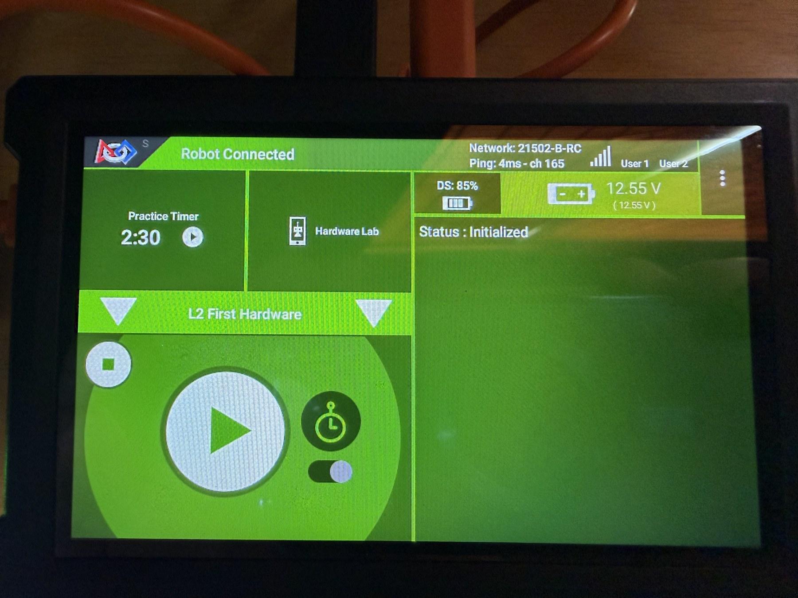
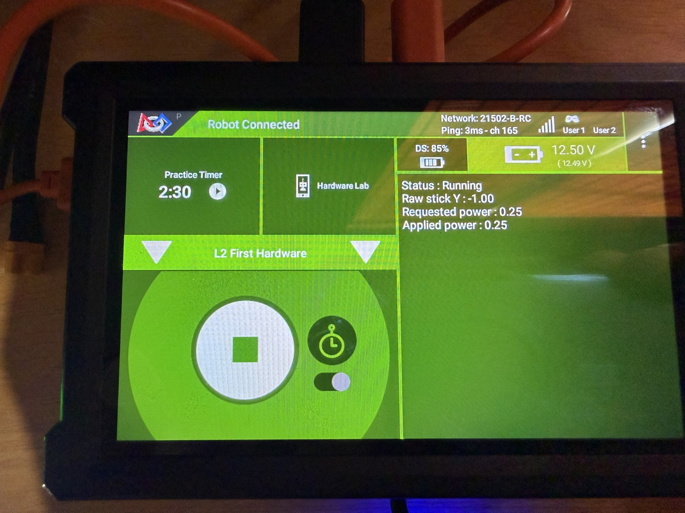
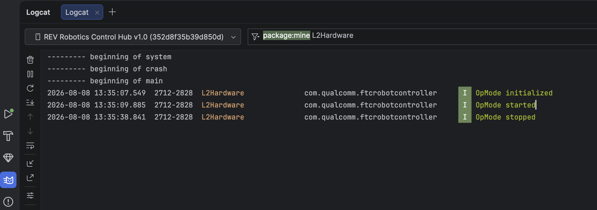
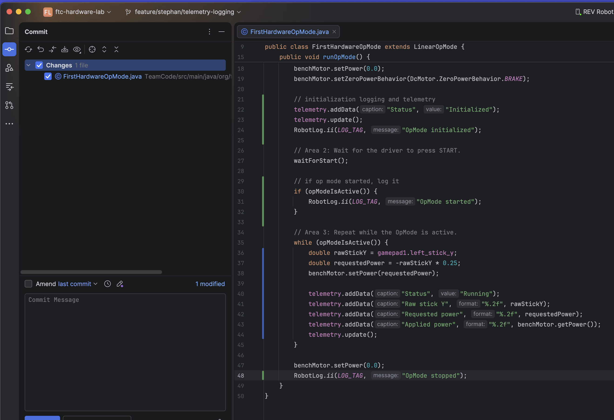

# Lesson 2: Seeing What the Robot Is Doing

The motor moved in Lesson 1, but the Driver Station did not explain what the
program requested or which lifecycle state it reached. You will add live telemetry
for the operator and event logging for later diagnosis.

## Your mission

| | |
|---|---|
| **Time** | 60–90 minutes |
| **FTC focus** | telemetry, `RobotLog`, observable behavior |
| **Git focus** | inspect a visual diff and write a focused commit message |
| **AI tutor** | judge whether each message provides useful evidence |

## Your goal

By the end of this lesson, you can:

- distinguish Driver Station telemetry from Robot Controller logs;
- report requested and applied values with useful labels;
- record lifecycle events without flooding the log; and
- verify telemetry and lifecycle events in the tools where each one appears.

## Get ready

Switch to `student/<your-name>` and pull the Lesson 1 merge. Create and check out:

```text
feature/<your-name>/telemetry-logging
```

Open `FirstHardwareOpMode.java`. Before editing, run it once and list three
questions the Driver Station cannot currently answer.

This lesson changes only what the program reports. The joystick-to-motor behavior
from Lesson 1 should remain the same.

## Telemetry versus logging

Telemetry is live information sent to the Driver Station. Values added with
`telemetry.addData(...)` are sent when `telemetry.update()` runs. Rapidly changing
values such as stick input and motor power belong here.

```java
telemetry.addData("Stick Y", "%.2f", gamepad1.left_stick_y);
telemetry.addData("Requested power", "%.2f", requestedPower);
telemetry.addData("Applied power", "%.2f", benchMotor.getPower());
telemetry.update();
```

Logs record diagnostic events on the Robot Controller. Use `RobotLog` for events
such as initialization, Start, Stop, and faults—not for the same value on every
fast loop.

```java
import com.qualcomm.robotcore.util.RobotLog;

private static final String LOG_TAG = "L2Hardware";
```

An informational event can be written with:

```java
RobotLog.ii(LOG_TAG, "OpMode initialized");
```

View live entries in Android Studio's Logcat window while connected to the Control
Hub and filter on `L2Hardware`. The exact Logcat interface may differ by Android
Studio version; preserve the tag so the filter remains useful.

## Complete one area at a time

Add and test each area below before moving to the next. Keep the motor limited to
the same power used in Lesson 1.

### 1. Add the logging import and tag

Place the import with the other imports and the constant inside the class:

```java
import com.qualcomm.robotcore.util.RobotLog;

private static final String LOG_TAG = "L2Hardware";
```

The tag gives related log messages one searchable name. It does not appear on the
Driver Station unless you also add it to telemetry.

### 2. Report that initialization finished

After the motor is mapped and its safe defaults are applied, add:

```java
telemetry.addData("Status", "Initialized");
telemetry.update();
RobotLog.ii(LOG_TAG, "OpMode initialized");
```

`addData(...)` prepares one Driver Station line. `update()` sends the prepared
telemetry. The log call records a separate event for Logcat. The expected result
after INIT is a stationary motor, `Status: Initialized` on the Driver Station,
and one initialization event in Logcat.

### 3. Record Start without mislabeling an early Stop

Use the lifecycle condition to record Start only if the OpMode is actually active:

```java
waitForStart();

if (opModeIsActive()) {
    RobotLog.ii(LOG_TAG, "OpMode started");
}
```

This guard matters because `waitForStart()` can also return after STOP. Unlike the
Lesson 1 loop, this is a one-time action after the wait, so its condition must be
checked explicitly.

### 4. Make each motor command observable

Keep the three values separate inside the active loop:

```java
double rawStickY = gamepad1.left_stick_y;
double requestedPower = -rawStickY * 0.25;
benchMotor.setPower(requestedPower);

telemetry.addData("Status", "Running");
telemetry.addData("Raw stick Y", "%.2f", rawStickY);
telemetry.addData("Requested power", "%.2f", requestedPower);
telemetry.addData("Applied power", "%.2f", benchMotor.getPower());
telemetry.update();
```

- `rawStickY` is what the gamepad supplied.
- `requestedPower` is what your calculation asked the motor to use.
- `getPower()` reports the power command currently stored by the motor object; it
  does not measure physical speed or torque.

With the stick centered, all three numeric values should be close to zero. Moving
the stick should show the sign change and the `0.25` limit.

### 5. Record the normal end of the loop

Keep the safe stop from Lesson 1, then log the lifecycle event:

```java
benchMotor.setPower(0.0);
RobotLog.ii(LOG_TAG, "OpMode stopped");
```

These lines run after `opModeIsActive()` becomes false. The expected result is a
zero motor-power command and one stopped event—not a repeated message from every
loop.

## Put the pieces together

Your revised Lesson 1 OpMode should now provide:

- `Initialized` telemetry before `waitForStart()`;
- `Running` telemetry inside the active loop;
- raw left-stick input;
- calculated requested power;
- power returned by `benchMotor.getPower()`;
- an initialization log event;
- a Start log event only when the OpMode becomes active; and
- a stopped log event after the loop.

Do not log on every loop. Do not include names, credentials, Wi-Fi information, or
other private data in telemetry or logs.

Before running, predict how the raw stick value, requested power, and applied power
will relate. Collect evidence for:

1. the stick centered;
2. the stick approximately halfway forward;
3. the stick fully backward; and
4. the OpMode after Stop.

Think about which observation confirms the calculation and which displayed value
would expose a sign or scaling mistake. You do not need to record an answer.

## Check the Driver Station telemetry

Deploy the updated app to the Control Hub, then use the Driver Station:

1. Select **L2 First Hardware** and press INIT.
2. Confirm the telemetry shows `Status: Initialized` before the motor can respond
   to the joystick.
3. Press PLAY and confirm the status changes to `Running`.
4. Center the left stick. Raw input, requested power, and applied power should all
   be close to zero.
5. Move the stick approximately halfway in each direction. Confirm the signs
   change and the applied command remains limited.
6. Move the stick through its full range. Requested and applied power must remain
   between `-0.25` and `0.25`.
7. Press Stop and confirm the motor stops.

After INIT, the Driver Station should show the initialized status while the PLAY
button is still available:



After PLAY, the running display should show the raw stick input beside the
requested and applied motor power:



The three numeric values answer different questions. If the motor behaves
unexpectedly, first identify whether the unexpected value began with the gamepad
input, the calculation, or the command sent to the motor.

## Check the Robot Controller log

Keep the Control Hub connected to Android Studio, then:

1. Open **View → Tool Windows → Logcat**.
2. Select the Control Hub in the device list and the Robot Controller app or
   process if Logcat asks for one.
3. Enter `L2Hardware` in the Logcat search or filter field.
4. Run **L2 First Hardware** from INIT through PLAY and Stop again.
5. Confirm the filtered log contains one event for each lifecycle point:

   ```text
   OpMode initialized
   OpMode started
   OpMode stopped
   ```

6. Confirm the log does not add another message on every active loop.

With `L2Hardware` in the filter, Logcat should look similar to this after one
complete run:



Driver Station telemetry is for changing information the operator needs now.
Logcat preserves occasional diagnostic events that a programmer may inspect
later. Both describe the same run, but they serve different audiences.

## Git checkpoint

Open Android Studio's Commit window and inspect the Lesson 2 diff. It should look
similar to this example, although line numbers and window layout may differ:



In the Commit window:

- confirm the current branch is `feature/<your-name>/telemetry-logging`;
- confirm only the intended lesson file is selected;
- inspect every highlighted change and confirm it belongs to this exercise;
- commit with a focused message;
- push the feature branch;
- open a pull request into `student/<your-name>`;
- include the Driver Station and Robot Controller log verification in the pull
  request description;
- obtain a review and merge the pull request; and
- update your local personal branch.

## Ask your AI tutor

> Review my telemetry and logging without editing. For each message, explain what
> question it answers, whether it belongs in live telemetry or a log, and whether
> it could flood output. Ask me for an observed value before deciding the behavior
> is correct.

## Check your work

You are finished when:

- telemetry distinguishes raw input, requested power, and applied power;
- lifecycle messages appear at the expected times;
- repeated loop data is telemetry rather than high-volume logging;
- Logcat can find the events using your tag;
- Stop still leaves the motor at zero power; and
- the reviewed change is merged into your personal branch.

## Reflect

What information is useful to the driver right now but would become noise in a
persistent log?

Continue to
[Lesson 3: Positional Servos](../03-positional-servos/README.md).
