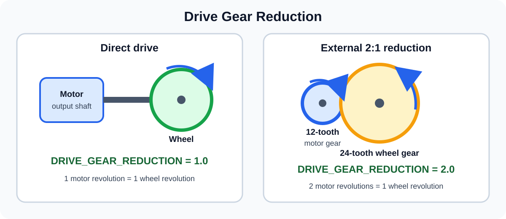

# Lesson 7: Encoders and Measured Movement

Power tells a motor how hard to run. An encoder measures shaft rotation so the
motor can move toward a repeatable target. In this lesson, you will first move a
marked wheel one revolution and then convert encoder ticks into inches around
the wheel's rim.

The test bench will remain fixed. The wheel gives you a visible way to connect
encoder ticks with physical movement.

## Your mission

| | |
|---|---|
| **Time** | 60–90 minutes |
| **FTC focus** | encoder ticks, ticks per revolution, `RUN_TO_POSITION`, ticks per inch |
| **Git focus** | inspect and review the motor code separately from its conversion formula |
| **AI tutor** | verify units and calculations without inventing hardware values |

## Your goal

By the end of this lesson, you can:

- explain what an encoder tick represents;
- find the manufacturer's ticks-per-revolution value for a motor;
- use `RUN_TO_POSITION` to move one output-shaft revolution;
- convert wheel diameter and external gearing into ticks per inch; and
- command a measured distance around the wheel's rim.

## Get ready

Update `student/<your-name>` and create:

```text
feature/<your-name>/encoder-distance
```

Create `EncoderDistanceOpMode.java` in the Level 2 package.

## Start with an OpMode skeleton

Enter this skeleton first. The numbered areas show where you will add code.

```java
package org.firstinspires.ftc.teamcode.level2;

import com.qualcomm.robotcore.eventloop.opmode.LinearOpMode;
import com.qualcomm.robotcore.eventloop.opmode.TeleOp;
import com.qualcomm.robotcore.hardware.DcMotor;

@TeleOp(name = "L2 Encoder Distance", group = "Level 2")
public class EncoderDistanceOpMode extends LinearOpMode {
    private DcMotor benchMotor;

    @Override
    public void runOpMode() {
        // Area 1: Map and configure the motor.

        // Wait for PLAY.
        waitForStart();

        // Area 2: Command one encoder movement.
        if (opModeIsActive()) {

        }

        // Area 3: Leave the motor stopped.
        benchMotor.setPower(0.0);
        benchMotor.setMode(DcMotor.RunMode.RUN_USING_ENCODER);
    }
}
```

Build the project. Fix any package, import, or syntax errors before continuing.

## Part 1 — Why use an encoder?

Running a motor at a particular power for a particular time does not guarantee a
repeatable movement. Battery voltage, friction, and load can change the result.

An encoder counts shaft rotation. `getCurrentPosition()` returns a signed count
relative to the most recent software reset:

```java
int currentTicks = benchMotor.getCurrentPosition();
```

The count is measured in **ticks**, not revolutions or inches. The program must
supply the mechanical information that gives those ticks physical meaning.

An encoder measures shaft rotation. It does not automatically know the wheel
diameter, external gearing, or how far a robot traveled across the field.

## Part 2 — Find ticks per revolution

Ticks per revolution tells you how many encoder counts represent one complete
revolution of the geared motor's output shaft. FTC examples call this
**counts per motor revolution**.

Go to the motor manufacturer's website, find the exact motor listed in the
[Hardware Lab Contract](../../docs/hardware-lab-contract.md), and locate its
encoder resolution at the output shaft.

Add these constants below the `benchMotor` field:

```java
private static final double TICKS_PER_MOTOR_REV = 0.0;
private static final double TEST_POWER = 0.25;
```

Replace `0.0` with the manufacturer's value. Keep it as a `double` because the
specification may contain a decimal. `TEST_POWER` limits the movement to 25%
power while you test.

## Part 3 — Configure the motor and encoder

In **Area 1**, add:

```java
benchMotor = hardwareMap.get(DcMotor.class, "bench_motor");
benchMotor.setPower(0.0);
benchMotor.setDirection(DcMotor.Direction.FORWARD);
benchMotor.setZeroPowerBehavior(DcMotor.ZeroPowerBehavior.BRAKE);

benchMotor.setMode(DcMotor.RunMode.STOP_AND_RESET_ENCODER);
benchMotor.setMode(DcMotor.RunMode.RUN_USING_ENCODER);

telemetry.addData("Status", "Encoder reset");
telemetry.addData("Current ticks", benchMotor.getCurrentPosition());
telemetry.update();
```

- `FORWARD` makes the first target use positive encoder counts.
- `BRAKE` makes the motor resist rotation at zero power. It does not hold an
  exact encoder position.
- `STOP_AND_RESET_ENCODER` changes the current count to zero.
- `RUN_USING_ENCODER` exits reset mode and prepares the motor for encoder use.

The order matters: reset the encoder before selecting the next run mode.

## Part 4 — Move one revolution

### Calculate the target

Still in **Area 1**, calculate a one-revolution target and replace the Part 3
initialization telemetry with:

```java
int targetTicks = (int) Math.round(TICKS_PER_MOTOR_REV);

telemetry.addData("Status", "Encoder reset");
telemetry.addData("Movement", "One revolution");
telemetry.addData("Target ticks", targetTicks);
telemetry.addData("Current ticks", benchMotor.getCurrentPosition());
telemetry.update();
```

The motor controller requires an integer target, so `Math.round()` converts the
manufacturer's decimal value to the nearest whole tick. `Math.round()` returns a
`long`, so `(int)` converts that result to the type required by
`setTargetPosition()`.

Keep `waitForStart()` immediately after this initialization code.

### Test — Target calculation

Build and deploy the project before adding the movement code:

| Test | Verify |
|---|---|
| Press **INIT**. | Telemetry shows `Encoder reset`, current ticks are near `0`, and target ticks match the rounded manufacturer value. |
| Press **PLAY**. | The motor does not move because the OpMode has not yet commanded `RUN_TO_POSITION` or nonzero power. |

### Command the movement

Inside the `if (opModeIsActive())` block in **Area 2**, add:

```java
benchMotor.setTargetPosition(targetTicks);
benchMotor.setMode(DcMotor.RunMode.RUN_TO_POSITION);
benchMotor.setPower(TEST_POWER);

while (opModeIsActive() && benchMotor.isBusy()) {
    telemetry.addData("Target ticks", targetTicks);
    telemetry.addData("Current ticks", benchMotor.getCurrentPosition());
    telemetry.update();
    idle();
}
```

Read the sequence from top to bottom:

- `setTargetPosition()` supplies the encoder count to reach.
- `RUN_TO_POSITION` tells the motor controller to move toward that target.
- `setPower()` starts the movement at limited power.
- `isBusy()` remains true while the motor is moving toward the target.
- the loop displays the target and current counts while the movement runs.
- **Area 3** stops the motor and leaves reset mode after the movement ends or
  Driver Station Stop is pressed.

### Check the complete one-revolution OpMode

Before testing, compare your assembled code with this complete version:

```java
package org.firstinspires.ftc.teamcode.level2;

import com.qualcomm.robotcore.eventloop.opmode.LinearOpMode;
import com.qualcomm.robotcore.eventloop.opmode.TeleOp;
import com.qualcomm.robotcore.hardware.DcMotor;

@TeleOp(name = "L2 Encoder Distance", group = "Level 2")
public class EncoderDistanceOpMode extends LinearOpMode {
    private DcMotor benchMotor;

    private static final double TICKS_PER_MOTOR_REV = 0.0;
    private static final double TEST_POWER = 0.25;

    @Override
    public void runOpMode() {
        benchMotor = hardwareMap.get(DcMotor.class, "bench_motor");
        benchMotor.setPower(0.0);
        benchMotor.setDirection(DcMotor.Direction.FORWARD);
        benchMotor.setZeroPowerBehavior(DcMotor.ZeroPowerBehavior.BRAKE);

        benchMotor.setMode(DcMotor.RunMode.STOP_AND_RESET_ENCODER);
        benchMotor.setMode(DcMotor.RunMode.RUN_USING_ENCODER);

        int targetTicks = (int) Math.round(TICKS_PER_MOTOR_REV);

        telemetry.addData("Status", "Encoder reset");
        telemetry.addData("Movement", "One revolution");
        telemetry.addData("Target ticks", targetTicks);
        telemetry.addData("Current ticks", benchMotor.getCurrentPosition());
        telemetry.update();

        waitForStart();

        if (opModeIsActive()) {
            benchMotor.setTargetPosition(targetTicks);
            benchMotor.setMode(DcMotor.RunMode.RUN_TO_POSITION);
            benchMotor.setPower(TEST_POWER);

            while (opModeIsActive() && benchMotor.isBusy()) {
                telemetry.addData("Target ticks", targetTicks);
                telemetry.addData(
                        "Current ticks",
                        benchMotor.getCurrentPosition());
                telemetry.update();
                idle();
            }
        }

        benchMotor.setPower(0.0);
        benchMotor.setMode(DcMotor.RunMode.RUN_USING_ENCODER);
    }
}
```

Replace `0.0` in the complete example with the value you researched.

### Test — One revolution

Before running this test:

- confirm the encoder cable is connected;
- attach the wheel securely to the motor output shaft;
- make sure the wheel cannot strike the bench or nearby objects; and
- align a tape mark on the wheel with a stationary reference mark on the bench.

Do not try to turn the motor shaft by hand. Build and deploy the project, then
complete each test:

| Test | Verify |
|---|---|
| Press **INIT**. | Current ticks are near `0`, and target ticks match the rounded manufacturer value. |
| Press **PLAY**. | The wheel moves at limited power while current ticks approach target ticks. |
| Allow the movement to finish. | The wheel stops near the target count, and its tape mark returns approximately to the reference mark. |
| Run the test again and press Driver Station **Stop** during movement. | The movement ends and the final cleanup commands zero motor power. |

If the wheel does not complete approximately one revolution, stop and check the
exact motor model, encoder cable, manufacturer specification, target value, and
wheel attachment. Do not change the power to correct a distance error.

## Part 5 — Convert ticks into inches

One wheel revolution moves a point on the rim through one wheel circumference:

```text
wheel circumference = wheel diameter × π
```

That circumference is also the **inches in one wheel revolution**. For example,
a 4-inch wheel moves a point on its rim approximately `12.57` inches during one
revolution.

Measure the wheel diameter in inches. Add these constants with the other class
constants:

```java
private static final double DRIVE_GEAR_REDUCTION = 1.0;
private static final double WHEEL_DIAMETER_INCHES = 4.0;
private static final double MOVE_DISTANCE_INCHES = 6.0;

private static final double TICKS_PER_WHEEL_REV = TICKS_PER_MOTOR_REV * DRIVE_GEAR_REDUCTION;
private static final double INCHES_PER_WHEEL_REV = WHEEL_DIAMETER_INCHES * Math.PI;
private static final double TICKS_PER_INCH = TICKS_PER_WHEEL_REV / INCHES_PER_WHEEL_REV;
```

Replace `4.0` with your measured wheel diameter. `MOVE_DISTANCE_INCHES` keeps the
requested movement separate from the conversion formula. It is set to `6.0` to
show that the program can request any safe distance, not only one inch. Change
this value when you want to test a different distance.

`DRIVE_GEAR_REDUCTION` is the ratio between motor output-shaft revolutions and
wheel revolutions:



- The bench wheel is attached directly to the output shaft, so use `1.0`.
- External gears would change this value. For example, a 12-tooth motor gear
  driving a 24-tooth wheel gear uses `2.0`.
- Do not include the motor's internal gearbox again; its effect is already in
  `TICKS_PER_MOTOR_REV`.

The three calculated constants make the units visible:

- `TICKS_PER_WHEEL_REV` is the number of encoder ticks in one wheel revolution.
- `INCHES_PER_WHEEL_REV` is the wheel circumference.
- `TICKS_PER_INCH` divides the ticks in one wheel revolution by the inches in
  that revolution.

### Change the target calculation

Replace the one-revolution target calculation with:

```java
int targetTicks = (int) Math.round(MOVE_DISTANCE_INCHES * TICKS_PER_INCH);
```

Multiplying the requested distance by `TICKS_PER_INCH` can produce a decimal.
`Math.round()` selects the nearest whole encoder tick and returns a `long`.
The `(int)` cast converts it to the integer type required by
`setTargetPosition()`.

The encoder was reset during INIT, so this single movement still uses a target
measured from zero. Relative targets based on `getCurrentPosition()` will be
introduced later when the robot needs to perform several movements.

Replace the initialization telemetry with:

```java
telemetry.addData("Requested distance", "%.2f in", MOVE_DISTANCE_INCHES);
telemetry.addData("Inches in 1 revolution", "%.2f", INCHES_PER_WHEEL_REV);
telemetry.addData("Ticks per inch", "%.2f", TICKS_PER_INCH);
telemetry.addData("Target ticks", targetTicks);
telemetry.addData("Current ticks", benchMotor.getCurrentPosition());
telemetry.update();
```

The `RUN_TO_POSITION` sequence does not change. Only the calculation that
produces `targetTicks` changed.

### Test Part 5 — Measured rim distance

Use flexible measuring tape or string to mark a `6.0`-inch arc around the wheel
rim, starting at the wheel's existing tape mark. Align the starting mark with
the stationary reference, build, and deploy the updated project.

| Test | Verify |
|---|---|
| Press **INIT**. | Requested distance is `6.00 in`, current ticks are near `0`, and target ticks equal the rounded distance calculation. |
| Press **PLAY**. | The current count approaches the calculated target while the wheel rotates. |
| Allow the movement to finish. | The wheel stops near the target count and rotates through approximately the marked 6-inch rim distance. |
| Change `MOVE_DISTANCE_INCHES` to `-6.0`, rebuild, and run again. | The target is negative, and the wheel moves approximately 6 inches in the opposite direction. |

The fixed bench does not travel six inches. The calculated distance describes
how far a point on the wheel rim moves around its circular path.

## How this relates to the FTC SDK example

The SDK's `RobotAutoDriveByEncoder_Linear` example uses the same
conversion formula and `RUN_TO_POSITION` sequence. The SDK calls these values
`COUNTS_PER_MOTOR_REV` and `COUNTS_PER_INCH`; in this lesson, we call them ticks
to match the units shown in telemetry. The SDK example also introduces:

- two drive motors;
- relative targets based on each motor's current position;
- a reusable `encoderDrive()` method; and
- a timeout that stops a movement that takes too long.

Those features are useful for a driving robot, but they are not required to
understand the first encoder movement. You will work with reusable hardware code
in Lesson 8.

## Understand the limits

An encoder measures motor-shaft rotation, not the robot's position on the field.
A target can be reached while real movement is still affected by an incorrect
wheel diameter, external gearing, a loose wheel, or wheel slip.

## Git checkpoint

In Android Studio:

- confirm the current branch is `feature/<your-name>/encoder-distance`;
- inspect the `EncoderDistanceOpMode.java` diff in the Commit window;
- confirm the motor constant and measured wheel diameter came from real hardware;
- commit with a focused message such as `Add encoder distance movement`;
- push and open a pull request into `student/<your-name>`;
- include the one-revolution and measured-distance test results in the pull
  request description;
- obtain a review and merge the pull request; and
- update your local personal branch before starting Lesson 8.

## Ask your AI tutor

> Review my encoder-distance OpMode without editing it. Check the order of the
> motor modes, follow the units from ticks per revolution to ticks per inch and
> target ticks, and ask for my real motor and wheel values instead of inventing
> them.

## Check your work

You are finished when:

- the ticks-per-revolution value comes from the correct motor manufacturer;
- the marked wheel moves approximately one revolution for that many ticks;
- the code calculates ticks per inch without early integer rounding;
- a requested rim distance produces the expected wheel movement;
- a negative distance reverses the movement direction;
- normal completion and Driver Station Stop both reach zero motor power; and
- you can explain why encoder rotation is not the same as robot field position.

Continue to
[Lesson 8: Building Reusable Hardware Code](../08-reusable-hardware-code/README.md).
