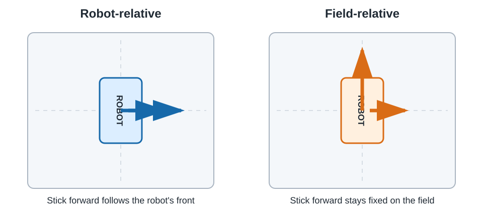

# 3.1: Robot-Relative and Field-Relative Driving

A mecanum robot can move forward, sideways, and rotate at the same time. Before
writing the equations, you need to decide what **forward** means.

In robot-relative driving, forward follows the front of the robot. In
field-relative driving, forward stays fixed on the field even after the robot
turns. This lesson uses the opening of Brogan Pratt's mecanum-drive video to make
that distinction visible before Java is involved.

## Your mission

| | |
|---|---|
| **Time** | 45–60 minutes |
| **FTC focus** | coordinate frames, driver intent, drivetrain safety contract |
| **Git focus** | document the robot contract before changing code |
| **AI tutor** | check predictions without inventing robot configuration facts |

## Your goal

By the end of this lesson, you can:

- explain the difference between robot-relative and field-relative commands;
- predict how the same joystick command changes after the robot turns;
- identify the front, left, and right sides of the team's robot;
- record the four drivetrain configuration names; and
- describe the checks required before drive motors receive power.

## Get ready

Update your personal branch and create:

```text
feature/<your-name>/level-3-mecanum
```

Do not power the drivetrain in this lesson. Put the robot on a stable cart or
stand, turn it off, and confirm that a mentor has approved the Level 3 test area.

Record the real robot contract. Do not copy names or directions from the video:

| Item | Team value |
|---|---|
| Front of robot | |
| Driver's field-facing direction at start | |
| Front-left motor configuration name | |
| Front-right motor configuration name | |
| Back-left motor configuration name | |
| Back-right motor configuration name | |
| Approved training-power limit | |
| Emergency-stop procedure | |

The Java strings used later must match the Driver Station configuration exactly.

## Watch, pause, and predict

Open [How To Program Drivetrains: Mecanum Drive](https://www.youtube.com/watch?v=sFCO4du5IZk&list=PLRHdgFNRLyaPiZ5rvINwMmGMHEIL9usla&index=18).

### Watch 0:00–1:03 — What you will build

Pause when the **Robot vs Field Orientation** chapter begins.

The completed system will have three layers:

```text
gamepad request
→ robot- or field-relative conversion
→ four motor powers
```

Point to the layer that will eventually need the IMU. Do not continue until you
can explain why the other two layers can work without it.

### Watch 1:03–5:10 — Two meanings of forward

Pause when **Mecanum Drive Class** begins.

Place a paper arrow or unpowered robot in front of you. Mark the robot's front.
For each row, predict its motion before physically rotating the arrow:

| Robot heading | Command | Robot-relative result | Field-relative result |
|---|---|---|---|
| Facing away from driver | stick forward | | |
| Turned 90° clockwise | stick forward | | |
| Facing the driver | stick forward | | |
| Turned 90° clockwise | stick right | | |

Robot-relative commands rotate with the robot. Field-relative commands remain
attached to the field and driver.



## Name the command values

The drive methods will use these names throughout Level 3:

| Value | Positive meaning |
|---|---|
| `forward` | move toward field/robot forward |
| `right` | strafe right |
| `rotate` | turn counterclockwise |

FTC gamepad Y values are negative when the left stick is pushed forward, so the
OpMode will deliberately invert that one input:

```java
double forward = -gamepad1.left_stick_y;
double right = gamepad1.left_stick_x;
double rotate = gamepad1.right_stick_x;
```

This is a coordinate conversion, not an arbitrary negative sign.

## Decide the teaching order

We will implement robot-relative drive first. It proves the motor mapping,
direction, mecanum mixing, and normalization without depending on heading.
Field-relative drive will then rotate the driver's request and reuse that tested
method.

```text
robot-relative:
driver request → wheel mixing → motor power

field-relative:
driver request → subtract robot heading → robot-relative method → motor power
```

If field-relative driving later behaves incorrectly, this separation lets you
test the drivetrain and IMU independently.

## Git checkpoint — Record the contract

Add the completed robot-contract table to the location chosen by your team.
Commit only that documentation:

```text
Document Level 3 robot drive contract
```

Do not commit guessed values. Mark an unknown value as **needs mentor
verification**.

## Ask your AI tutor

> Quiz me with four robot-heading and joystick-direction scenarios. Let me
> predict both robot-relative and field-relative motion before explaining each
> answer. Do not write drivetrain code yet.

## Check your work

- [ ] I can point to the physical front of the robot.
- [ ] The four motor names came from the active Driver Station configuration.
- [ ] The training-power limit and stop procedure were mentor approved.
- [ ] I can explain why robot-relative drive is implemented first.
- [ ] I can explain why field-relative drive needs a heading measurement.

Continue to [3.2](../02-reusable-mecanum-drive/README.md) to create the reusable
drivetrain class.

## Reflect

Which robot heading makes robot-relative and field-relative controls feel most
different to the driver?
